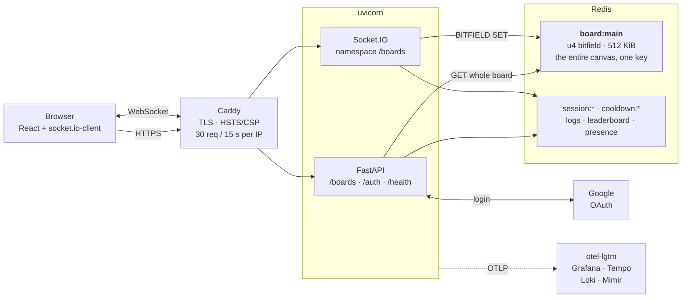

# PixelWars — backend

[](https://github.com/maybemuf/pixelwars_be/actions/workflows/ci.yml)
[](LICENSE)
[](https://www.python.org/downloads/)

An r/place-style collaborative canvas: a 1024×1024 shared board where anyone can watch
live and any logged-in user can paint one pixel per cooldown window.

The whole board is **one Redis key** — a `u4` bitfield, 512 KiB for 1,048,576 pixels — so
a paint is a single atomic bit-range write with no locking and no per-pixel rows.
FastAPI serves the initial board over HTTP; everything after that is Socket.IO.

**[▶ Live demo](https://maybemuf.github.io/pixelwars_fe/)** · frontend lives in a separate
repo ([pixelwars_fe](https://github.com/maybemuf/pixelwars_fe): React 19, Vite, Tailwind,
socket.io-client). This repo is the backend.

> Painting on the demo needs a Google login. Watching does not.

## Architecture



A second Redis connection backs Socket.IO's own pub/sub, so the app can run more than one
worker without clients missing each other's pixels.

## Why Redis BITFIELD

The board is stored as a single `u4` bitfield under `board:main`:

| | |
|---|---|
| Pixels | 1024 × 1024 = **1,048,576** |
| Bits per pixel | **4** (`u4`) → 16-colour palette |
| Total board size | **512 KiB**, in one key |
| A paint | `BITFIELD board:main SET u4 #<offset> <colour>` |
| A full read | `GET board:main` |

Three properties fall out of that, and they are the reason for the choice:

1. **A paint is atomic on its own.** `BITFIELD SET` on a bit range needs no `WATCH`, no
   transaction, and no application lock. Concurrent painters cannot tear each other's
   writes, so the hot path stays a single round trip.
2. **The whole board is one read.** No pagination, no `N` keys, no join. A new client is
   caught up with one `GET`.
3. **Memory is bounded and predictable** at exactly 4 bits per pixel. A row-per-pixel
   table would mean a million rows, a read-modify-write and a transaction per paint, plus
   an index larger than this entire board.

The cooldown rides along on the same idea: `SET cooldown:<user> 1 EX 60 NX` either wins or
loses atomically, and `PTTL` in the same pipeline tells the client exactly how long to
wait. No timestamp comparison, no clock skew.

### Where this design is honest about its limits

- `GET /boards` ships all 512 KiB base64-encoded — about **682 KiB per cold load**. Fine
  for one board and a handful of viewers; a real deployment would want a cached snapshot
  or a delta protocol.
- `place_pixel` runs **two pipelines** that are not atomic together
  ([`app/services/boards.py`](app/services/boards.py)): the cooldown gate, then the write.
  A crash between them burns a user's cooldown without painting a pixel. Losing one pixel
  is an acceptable trade for keeping the gate a single round trip; combining them would
  need a Lua script.
- One board, hardcoded as `board:main`. The key constants exist, the multi-board routing
  does not.

## Quick start

```bash
cp .env.example .env
docker compose up --build
open http://localhost:8000/docs
```

That gives you a working, paintable-by-nobody board plus live API docs. Everything has a
usable default; the only values you might want to change are documented inline in
[`.env.example`](.env.example).

**To actually paint**, add Google OAuth credentials — the board is anonymous to watch and
authenticated to write:

1. [Google Cloud Console](https://console.cloud.google.com) → APIs & Services →
   Credentials → **Create OAuth client ID** → *Web application*.
2. Add `http://localhost:8000/auth/google/callback` as an authorized redirect URI.
3. Put the client ID and secret in `.env`, then `docker compose up -d --force-recreate api`.

Grafana (traces, metrics, logs) comes up alongside at <http://localhost:3010>.

## API

Full interactive reference at `/docs`; the schema is at `/openapi.json`.

| Endpoint | What it does | Statuses |
|---|---|---|
| `GET /boards` | The whole board, base64 of the raw bitfield | 200 |
| `POST /auth/google` | Start the Google login | 307 |
| `GET /auth/google/callback` | Completes login, sets the session cookie | 307, 401 |
| `POST /auth/logout` | Destroys the session; idempotent | 200 |
| `GET /health/live` | Liveness — deliberately dependency-free | 200 |
| `GET /health/ready` | Readiness — pings Redis with a 2 s timeout | 200, 503 |

### Socket.IO (namespace `/boards`)

Live updates, and the only way to paint. Not part of the OpenAPI schema.

| Direction | Event | Payload |
|---|---|---|
| client → server | `place_pixel` | `{"offset": int, "color": int}` |
| ← ack | *(return value)* | `{"retry_in_ms": int}`, or `{"error": ...}` |
| server → client | `pixel` | `{"offset": int, "color": int, "id": str}` |
| server → client | `users` | `{"count": int}` |

`offset` is `y * 1024 + x`, range `0..1048575`; `color` is a palette index `0..15`.
The ack's `error` is one of `unauthenticated`, `invalid pixel`, or `cooldown` — the last
also carries `retry_in_ms`. `pixel` is broadcast on every accepted placement; `users`
fires on each connect and disconnect.

Anyone may connect and watch. The session cookie is read at connect time and
**re-checked against Redis on every placement**, so a logout revokes painting on an
already-open socket without waiting for a reconnect.

### On API versioning

There is deliberately no `/v1` prefix. `API_VERSION` is a semver string that surfaces in
OpenAPI, the startup log line and OTel's `service.version` — it identifies the build, not
the URL shape. With a single first-party client, a path version would be ceremony; if a
second consumer ever appears, adding one is a router-prefix change.

## Observability

OpenTelemetry traces, metrics and logs over OTLP, off by default (`OTEL_ENABLED=false`)
and no-op when disabled. `docker compose up` includes a self-contained
[otel-lgtm](https://github.com/grafana/docker-otel-lgtm) stack, so there is nothing to
configure.

Seven instruments in [`app/core/telemetry.py`](app/core/telemetry.py): four counters
(pixel attempts, socket connects, socket disconnects, logins), a histogram (placement
duration), and two gauges (users online, total pixels placed). Every placement records the
same three signals labelled with its outcome — `accepted`, `cooldown`, `invalid`, or
`unauthenticated` — so the rejection mix is visible without log grepping.

Logs are JSON in production and human-readable in dev, emitted through a
`QueueHandler` so a slow sink never blocks a request. Every line carries a correlation ID
and, when tracing is on, the trace and span IDs — a `TraceContextFilter` stamps
placeholders when it is off, so the format never breaks.

## Security

- **Sessions**: opaque 32-byte tokens in Redis, never JWTs, so a logout is a `DEL`.
  Cookies are `HttpOnly`, `Secure`, `SameSite=none`. The 14-day TTL **slides** — `GETEX`
  refreshes Redis and the response refreshes the cookie, together, so neither outlives
  the other.
- **Reverse proxy**: HSTS, `X-Frame-Options: DENY`, `nosniff`,
  `Referrer-Policy: strict-origin-when-cross-origin`, `Server` suppressed, and a
  `default-src 'none'` CSP relaxed only for the `/docs` paths that need a CDN.
- **Rate limiting**: 30 requests per 15 s per IP at the edge.
- **Container**: multi-stage build, runs as non-root `uid 1000`, no build tooling in the
  runtime image, base images pinned by digest.
- **Redis**: `maxmemory-policy noeviction` — the board must fail a write loudly rather
  than silently evict itself — with AOF on and
  [`scripts/backup-redis.sh`](scripts/backup-redis.sh) for off-box hourly copies.
- **CORS**: a single allowed origin, derived from `FRONTEND_URL`.

## Development

```bash
uv sync                    # install, including dev tooling
uv run pre-commit install  # ruff + ty on every commit

uv run pytest              # 38 tests
uv run ruff check .        # lint
uv run ruff format .       # format
uv run ty check            # types (0 diagnostics)
```

Tests need neither a `.env` nor a running Redis: `tests/conftest.py` sets the environment
before the app is imported and puts one `fakeredis` instance behind both Redis access
paths. `compose.override.yaml` is committed, so `docker compose up` gives hot reload and
published ports with no extra flags.

CI runs lint, format, types and tests, then builds the image and validates the Caddyfile
in a second job.

## Project layout

```
app/
  main.py            app assembly, middleware, Socket.IO server, OpenAPI metadata
  core/              settings, Redis key constants, telemetry, logging
  routers/           auth (Google OAuth), boards, health
  sockets/boards.py  BoardNamespace: connect, disconnect, place_pixel
  services/          the Redis-facing logic
  schemas/           pydantic request/response models
tests/               38 tests, fakeredis, no external services
scripts/             Redis backup
```

## Roadmap

- Merge `place_pixel`'s two pipelines into one Lua script, so a crash cannot burn a
  cooldown without painting.
- Serve a cached board snapshot instead of 682 KiB per cold load.
- Multiple boards — the key constants are ready, the routing is not.
- Expose the leaderboard and the replay stream; both are already written on every paint.
- `UserDep` exists but no HTTP endpoint authenticates yet; the only auth check is in the
  socket handler.

## License

[MIT](LICENSE)
